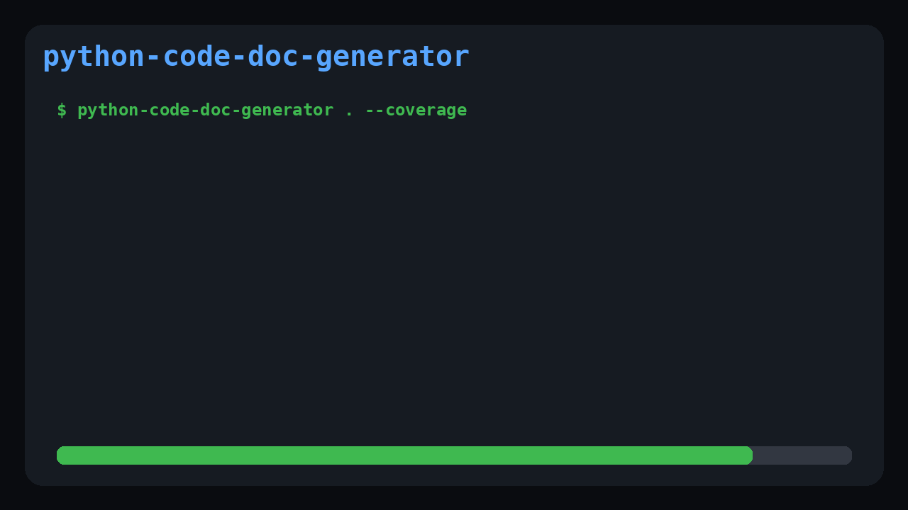

# python-code-doc-generator

[](https://pypi.org/project/python-code-doc-generator/)
[](https://pypi.org/project/python-code-doc-generator/)
[](https://github.com/nyks-jpg/python-code-doc-generator/actions/workflows/python-test.yml)
[](LICENSE)

<p align="center">
  
</p>

<p align="center"><strong>Generate documentation and measure documentation coverage from Python source code in seconds.</strong></p>

- Static analysis with Python AST
- Markdown documentation generation
- JSON export
- Documentation coverage reporting
- CI/CD friendly
- Offline by default
- No external API required

**python-code-doc-generator** is a lightweight, CI-friendly command-line tool that scans Python source files, extracts function-level metadata, and generates clean Markdown or JSON documentation from static analysis.

The project is designed for open source maintainers, platform teams, internal developer experience groups, and engineering organizations that want documentation quality checks to become part of the normal delivery workflow.

## Why This Project?

Large Python codebases often grow faster than their documentation. Functions are added, signatures change, return types evolve, and onboarding material becomes stale. In small projects this is inconvenient; in large projects it becomes an engineering cost.

python-code-doc-generator helps teams:

- Generate function-level documentation from real source code.
- Review documentation output during pull requests.
- Detect undocumented or structurally unclear modules earlier in the delivery cycle.
- Produce Markdown documentation that can be published as a CI artifact.
- Produce JSON output that can feed internal developer portals, dashboards, or quality gates.
- Run documentation checks offline without sending proprietary code to external services.

The first version intentionally uses only the Python standard library. It relies on `ast` for static analysis, which keeps the tool portable, fast, and safe for enterprise environments.

## Quick Start

Generate Markdown documentation for a single file:

```bash
python-code-doc-generator main.py
```

Generate Markdown documentation for a project directory:

```bash
python-code-doc-generator . --output FUNCTION_DOCS.md
```

Generate English documentation:

```bash
python-code-doc-generator . --language en --output FUNCTION_DOCS.md
```

Generate JSON for automation:

```bash
python-code-doc-generator . --format json --output function-docs.json
```

Generate documentation coverage metrics:

```bash
python-code-doc-generator . --coverage --output FUNCTION_DOCS.md
python-code-doc-generator . --coverage --format json --output function-docs.json
```

Analyze only functions touched by a pull request diff:

```bash
git fetch origin main
python-code-doc-generator . --coverage --diff-base origin/main --language en --output pr-doc-analysis.md
```

Include private functions:

```bash
python-code-doc-generator . --include-private
```

Fail the command when no functions are discovered:

```bash
python-code-doc-generator . --fail-on-empty
```

Fail the command when a Python file cannot be parsed:

```bash
python-code-doc-generator . --strict
```

## Core Capabilities

- Scan a single Python file or an entire directory.
- Traverse directories recursively by default.
- Detect functions, methods, and async functions.
- Extract signatures, parameters, annotations, default values, decorators, return annotations, and direct `raise` statements.
- Reuse existing docstrings when available.
- Generate readable summaries in Turkish or English.
- Export Markdown for human readers.
- Export JSON for automation, dashboards, or downstream processing.
- Calculate docstring-based documentation coverage with `--coverage`.
- Analyze documentation status for changed pull request functions with `--diff-base`.
- Support CI-oriented flags such as `--strict` and `--fail-on-empty`.

## Documentation Coverage

Documentation coverage is available through the `--coverage` flag. A function is counted as documented when it contains a Python docstring. The metric is intentionally simple and deterministic, making it suitable for CI logs, generated Markdown reports, and JSON-based dashboards.

Example command:

```bash
python-code-doc-generator . --coverage --language en --output generated-docs.md
```

Example terminal and Markdown summary:

```text
Documentation Coverage: 87%
Total Functions: 200
Documented Functions: 174
Undocumented Functions: 26
```

JSON output includes the same signal under a top-level `coverage` field when `--coverage` is enabled:

```json
{
  "coverage": {
    "percentage": 87,
    "total_functions": 200,
    "documented_functions": 174,
    "undocumented_functions": 26
  },
  "functions": []
}
```

This signal is useful for pull request review, repository health dashboards, and long-running documentation improvement programs.

## GitHub Actions Example

The repository includes a working GitHub Actions workflow. The following minimal example shows how the CLI can be used in another Python project:

```yaml
name: Documentation Quality

on:
  push:
  pull_request:

jobs:
  docs:
    runs-on: ubuntu-latest

    steps:
      - name: Check out repository
        uses: actions/checkout@v4
        with:
          fetch-depth: 0

      - name: Set up Python
        uses: actions/setup-python@v5
        with:
          python-version: "3.12"

      - name: Install package and test tools
        run: python -m pip install -e ".[dev]"

      - name: Run tests
        run: python -m pytest

      - name: Generate Markdown documentation
        run: python-code-doc-generator . --coverage --language en --strict --fail-on-empty --output generated-docs.md

      - name: Generate JSON documentation
        run: python-code-doc-generator . --coverage --format json --language en --strict --fail-on-empty --output generated-docs.json

      - name: Run diff-aware PR documentation analysis
        if: github.event_name == 'pull_request'
        run: python-code-doc-generator . --coverage --diff-base origin/${{ github.base_ref }} --language en --strict --fail-on-empty --output pr-doc-analysis.md

      - name: Upload documentation artifacts
        uses: actions/upload-artifact@v4
        with:
          name: generated-docs
          if-no-files-found: ignore
          path: |
            generated-docs.md
            generated-docs.json
            pr-doc-analysis.md
```

## Enterprise Advantages

- **Offline by default:** source code is analyzed locally.
- **No external API required:** suitable for private repositories and regulated environments.
- **Deterministic output:** generated from the checked-out repository state.
- **Small operational footprint:** no runtime service, database, or hosted dependency needed.
- **Automation-ready:** machine-readable JSON and human-readable Markdown are both supported.

## Roadmap

- Add unit tests for parser and renderer behavior. **Completed.**
- Add package metadata through `pyproject.toml`. **Completed.**
- Support configurable Markdown templates.
- Add class-level and module-level documentation sections.
- Add documentation coverage scoring. **Completed.**
- Add diff-aware pull request reporting. **Completed.**
- Add optional integration with LLM providers for richer natural language summaries.
- Add pre-commit hook examples.
- Publish the tool to PyPI.

## Contributing

Contributions are welcome. The project is intentionally small and approachable, making it a good place to contribute improvements to CLI behavior, documentation generation, static analysis, and CI workflows.

Recommended contribution areas:

- parser accuracy,
- Markdown and JSON output quality,
- CI/CD examples,
- documentation templates,
- test coverage,
- packaging improvements,
- real-world examples from open source projects.

Before opening a pull request, please read `CONTRIBUTING.md`.

## Installation

Install from PyPI after the package is published:

```bash
python -m pip install python-code-doc-generator
```

For local development, clone the repository:

```bash
git clone https://github.com/nyks-jpg/python-code-doc-generator.git
cd python-code-doc-generator
```

Create a virtual environment:

```bash
python -m venv .venv
source .venv/bin/activate
```

For Windows PowerShell:

```powershell
python -m venv .venv
.\.venv\Scripts\Activate.ps1
```

Install the package in editable mode:

```bash
python -m pip install -e .
```

Install development dependencies for tests:

```bash
python -m pip install -e ".[dev]"
```

> Runtime status: the CLI uses only the Python standard library. `pytest` is available through the optional `dev` extra for contributors.

## PyPI Usage

After installation, run the CLI directly:

```bash
python-code-doc-generator main.py
```

Generate Markdown documentation:

```bash
python-code-doc-generator main.py --language en --output generated-docs.md
```

Generate JSON documentation:

```bash
python-code-doc-generator main.py --format json --language en --output generated-docs.json
```

Check the installed version:

```bash
python-code-doc-generator --version
```

You can still run the tool from source during development:

```bash
python main.py main.py --language en
```

## Testing

Install the development extra and run the test suite:

```bash
python -m pip install -e ".[dev]"
python -m pytest
```

Run the same smoke checks used by CI:

```bash
python -m py_compile main.py
python-code-doc-generator --version
python-code-doc-generator main.py --coverage --language en --strict --fail-on-empty --output generated-docs.md
python-code-doc-generator main.py --coverage --format json --language en --strict --fail-on-empty --output generated-docs.json
```

## CI/CD Usage

In a company or large-scale open source project, this tool can be used as a documentation quality step inside CI/CD pipelines. It is especially useful in pull request validation, nightly documentation generation, and internal engineering quality dashboards.

### Recommended CI Pattern

A typical CI pipeline can perform the following checks:

1. Install Python and project dependencies.
2. Compile `main.py` to catch syntax errors.
3. Run the documentation generator against the repository.
4. Use `--strict` to fail on invalid Python files.
5. Use `--fail-on-empty` to fail if no functions are discovered.
6. Use `--coverage` to expose function docstring coverage in CI logs.
7. Save Markdown or JSON output as a CI artifact.

Example:

```bash
python -m pip install -e ".[dev]"
python -m py_compile main.py
python -m pytest
python-code-doc-generator . --coverage --strict --fail-on-empty --output generated-docs.md
python-code-doc-generator . --coverage --format json --strict --fail-on-empty --output generated-docs.json
```

### Pull Request Validation

For pull requests, teams can run:

```bash
git fetch origin main
python-code-doc-generator . --coverage --diff-base origin/main --strict --fail-on-empty --output docs/pr-doc-analysis.md
```

This gives maintainers a generated view of the changed codebase and highlights newly added or modified functions that are missing docstrings before merge.

### Documentation Artifact Publishing

For larger repositories, the generated Markdown file can be uploaded as a build artifact, committed to a documentation branch, or published through GitHub Pages, MkDocs, Docusaurus, Backstage, or an internal developer portal.

JSON output can also be consumed by:

- internal quality dashboards,
- repository health reports,
- code ownership systems,
- onboarding portals,
- documentation coverage checks.

## Diff-Aware Pull Request Analysis

Diff-aware analysis is available through `--diff-base`. It compares the requested base ref with `--diff-head` and reports documentation status only for functions whose source line range overlaps changed Python lines.

```bash
git fetch origin main
python-code-doc-generator . --coverage --diff-base origin/main --diff-head HEAD --language en --output pr-doc-analysis.md
```

Example output:

```text
Changed Functions: 8
Documented: 5
Missing Docstrings: 3

Warnings:
* process_payment()
* validate_order()
* create_invoice()
```

This mode is designed for GitHub Actions and other CI systems where reviewers need a compact documentation quality signal for the current pull request.

## Output Example

Below is a realistic Markdown output example generated for a Python service module.

````markdown
# Python Code Documentation

_Generated by Python Code Doc-Generator through static analysis._

## Documentation Coverage

```text
Documentation Coverage: 67%
Total Functions: 3
Documented Functions: 2
Undocumented Functions: 1
```

## Diff-Aware Pull Request Analysis

```text
Changed Functions: 3
Documented: 2
Missing Docstrings: 1

Warnings:
* InvoiceService.validate_order()
```

## `services/invoice_service.py`

### `InvoiceService.create_invoice`

- Kind: `method`
- Lines: `42-89`
- Signature: `def create_invoice(self, customer_id: str, items: list[InvoiceItem], *, currency: str = 'USD') -> Invoice`
- Summary: `InvoiceService.create_invoice` is documented as: Create a billable invoice for a customer from validated invoice items.
- Parameters:
  - `self` (kind `positional-or-keyword`)
  - `customer_id` (kind `positional-or-keyword`, type `str`)
  - `items` (kind `positional-or-keyword`, type `list[InvoiceItem]`)
  - `currency` (kind `keyword-only`, type `str`, default `'USD'`)
- Returns: `Invoice`
- Raises: `ValueError`, `InvoiceValidationError`
- Analysis:
  - Accepts `customer_id`, `items`, `currency` as input.
  - Expected to return a value compatible with `Invoice`.
  - Directly raises: `ValueError`, `InvoiceValidationError`.

### `calculate_invoice_total`

- Kind: `function`
- Lines: `104-121`
- Signature: `def calculate_invoice_total(items: list[InvoiceItem], tax_rate: Decimal) -> Decimal`
- Summary: `calculate_invoice_total` is documented as: Calculate the final invoice amount including tax.
- Parameters:
  - `items` (kind `positional-or-keyword`, type `list[InvoiceItem]`)
  - `tax_rate` (kind `positional-or-keyword`, type `Decimal`)
- Returns: `Decimal`
- Analysis:
  - Accepts `items`, `tax_rate` as input.
  - Expected to return a value compatible with `Decimal`.
````

This format is intentionally readable in pull requests, release notes, documentation portals, and local terminal output.

## Command Reference

```text
python-code-doc-generator PATH [options]
```

| Option | Description |
| --- | --- |
| `PATH` | Python file or directory to scan. |
| `-o, --output` | Write generated documentation to a file. |
| `--format markdown` | Generate Markdown output. This is the default. |
| `--format json` | Generate JSON output for automation. |
| `--language tr` | Generate Turkish summaries. This is the default. |
| `--language en` | Generate English summaries. |
| `--include-private` | Include functions whose names start with `_`. |
| `--no-recursive` | Scan only top-level `.py` files in a directory. |
| `--strict` | Fail if any scanned file cannot be parsed. |
| `--fail-on-empty` | Fail if no functions are discovered. |
| `--coverage` | Include docstring coverage metrics in Markdown, JSON, and CI logs. |
| `--diff-base REF` | Analyze documentation status for functions changed between `REF` and `--diff-head`. |
| `--diff-head REF` | Git head ref for diff-aware analysis. Default: `HEAD`. |
| `--version` | Print the tool version. |

## Competitive Positioning

python-code-doc-generator is not intended to replace Sphinx, MkDocs, or Docusaurus. Those tools are excellent documentation publishing systems. This project operates earlier in the workflow as a static analysis and documentation quality automation layer.

In practice, it can run before a documentation site is built:

- Sphinx, MkDocs, or Docusaurus publish curated documentation.
- python-code-doc-generator inspects Python code and produces function-level documentation signals.
- CI pipelines can use those signals to create artifacts, detect missing documentation, or feed developer portal metadata.

The goal is to complement documentation platforms, not compete with them.

## Repository Structure

```text
.
|-- .github/
|   `-- workflows/
|       `-- python-test.yml
|-- assets/
|   `-- python-code-doc-generator-demo.gif
|-- tests/
|   |-- test_cli.py
|   |-- test_diff_analysis.py
|   |-- test_parser.py
|   `-- test_renderers.py
|-- main.py
|-- pyproject.toml
|-- requirements.txt
|-- README.md
|-- CONTRIBUTING.md
|-- screenshot.png
`-- LICENSE
```

## OpenAI Integration Roadmap

- **Phase 1:** Stability of the current static analysis engine. **Completed.**
- **Phase 2:** AI-assisted documentation generation with OpenAI API integration to understand function intent. **Planned.**
- **Phase 3:** GitHub App support that automatically comments documentation suggestions directly on Pull Requests. **Planned.**

This roadmap directly supports the long-term goal of turning python-code-doc-generator into an intelligent documentation assistant for open source and enterprise repositories.

## Project Vision

The long-term vision is to make function-level documentation measurable, reviewable, and easier to maintain in active Python repositories. The project is moving toward:

- documentation coverage scoring,
- diff-aware pull request reviews,
- GitHub App support,
- OpenAI-powered function intent analysis,
- developer portal integrations.

The current static analysis engine is the foundation for that workflow. Future OpenAI integration is expected to improve the quality of generated explanations while keeping deterministic static metadata available for automation.

## Who Should Use This?

python-code-doc-generator is designed for teams and maintainers who want lightweight documentation automation without adopting a large documentation stack on day one.

It is especially useful for:

- open source maintainers,
- platform teams,
- internal developer experience teams,
- Python library authors,
- engineering managers.

## License

This project is licensed under the MIT License. See `LICENSE` for details.
