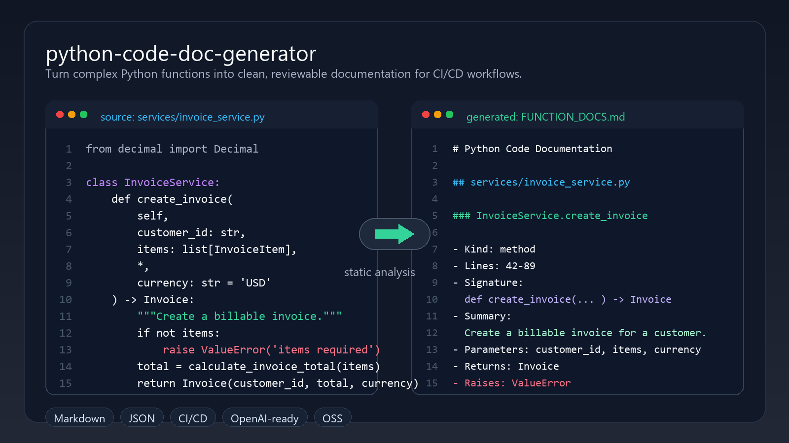

# python-code-doc-generator



**python-code-doc-generator** is a lightweight, CI-friendly command-line tool that scans Python source files, extracts function-level metadata, and generates clean Markdown or JSON documentation from static analysis.

The project is designed for open source maintainers, platform teams, internal developer experience groups, and engineering organizations that want documentation quality checks to become part of the normal delivery workflow.

## Why This Project?

Large Python codebases often grow faster than their documentation. Functions are added, signatures change, return types evolve, and onboarding material becomes stale. In small projects this is inconvenient; in large projects it becomes an engineering cost.

python-code-doc-generator helps teams:

- Generate function-level documentation from real source code.
- Review documentation output during pull requests.
- Detect undocumented or structurally unclear modules earlier in the delivery cycle.
- Produce Markdown documentation that can be published as a CI artifact.
- Produce JSON output that can feed internal developer portals, dashboards, or quality gates.
- Run documentation checks offline without sending proprietary code to external services.

The first version intentionally uses only the Python standard library. It relies on `ast` for static analysis, which keeps the tool portable, fast, and safe for enterprise environments.

## Core Capabilities

- Scan a single Python file or an entire directory.
- Traverse directories recursively by default.
- Detect functions, methods, and async functions.
- Extract signatures, parameters, annotations, default values, decorators, return annotations, and direct `raise` statements.
- Reuse existing docstrings when available.
- Generate readable summaries in Turkish or English.
- Export Markdown for human readers.
- Export JSON for automation, dashboards, or downstream processing.
- Support CI-oriented flags such as `--strict` and `--fail-on-empty`.

## Installation

Clone the repository:

```bash
git clone https://github.com/your-org/python-code-doc-generator.git
cd python-code-doc-generator
```

Create a virtual environment:

```bash
python -m venv .venv
source .venv/bin/activate
```

For Windows PowerShell:

```powershell
python -m venv .venv
.\.venv\Scripts\Activate.ps1
```

Install dependencies:

```bash
python -m pip install -r requirements.txt
```

> Current status: the tool uses only the Python standard library. The `requirements.txt` file is included to keep setup workflows consistent across local machines and CI systems.

## Quick Start

Generate Markdown documentation for a single file:

```bash
python main.py path/to/module.py
```

Generate Markdown documentation for a project directory:

```bash
python main.py path/to/project --output FUNCTION_DOCS.md
```

Generate English documentation:

```bash
python main.py path/to/project --language en --output FUNCTION_DOCS.md
```

Generate JSON for automation:

```bash
python main.py path/to/project --format json --output function-docs.json
```

Include private functions:

```bash
python main.py path/to/project --include-private
```

Fail the command when no functions are discovered:

```bash
python main.py path/to/project --fail-on-empty
```

Fail the command when a Python file cannot be parsed:

```bash
python main.py path/to/project --strict
```

## CI/CD Usage

In a company or large-scale open source project, this tool can be used as a documentation quality step inside CI/CD pipelines. It is especially useful in pull request validation, nightly documentation generation, and internal engineering quality dashboards.

### Recommended CI Pattern

A typical CI pipeline can perform the following checks:

1. Install Python and project dependencies.
2. Compile `main.py` to catch syntax errors.
3. Run the documentation generator against the repository.
4. Use `--strict` to fail on invalid Python files.
5. Use `--fail-on-empty` to fail if no functions are discovered.
6. Save Markdown or JSON output as a CI artifact.

Example:

```bash
python -m py_compile main.py
python main.py . --strict --fail-on-empty --output generated-docs.md
python main.py . --format json --strict --fail-on-empty --output generated-docs.json
```

### Pull Request Validation

For pull requests, teams can run:

```bash
python main.py src --strict --fail-on-empty --output docs/generated-functions.md
```

This gives maintainers a generated view of the changed codebase and helps reviewers notice undocumented or difficult-to-understand functions before merge.

### Documentation Artifact Publishing

For larger repositories, the generated Markdown file can be uploaded as a build artifact, committed to a documentation branch, or published through GitHub Pages, MkDocs, Docusaurus, Backstage, or an internal developer portal.

JSON output can also be consumed by:

- internal quality dashboards,
- repository health reports,
- code ownership systems,
- onboarding portals,
- documentation coverage checks.

### Enterprise Advantages

- **Offline by default:** source code is analyzed locally.
- **No external API required:** suitable for private repositories and regulated environments.
- **Deterministic output:** generated from the checked-out repository state.
- **Small operational footprint:** no runtime service, database, or hosted dependency needed.
- **Automation-ready:** machine-readable JSON and human-readable Markdown are both supported.

## Output Example

Below is a realistic Markdown output example generated for a Python service module.

```markdown
# Python Code Documentation

_Generated by Python Code Doc-Generator through static analysis._

## `services/invoice_service.py`

### `InvoiceService.create_invoice`

- Kind: `method`
- Lines: `42-89`
- Signature: `def create_invoice(self, customer_id: str, items: list[InvoiceItem], *, currency: str = 'USD') -> Invoice`
- Summary: `InvoiceService.create_invoice` is documented as: Create a billable invoice for a customer from validated invoice items.
- Parameters:
  - `self` (kind `positional-or-keyword`)
  - `customer_id` (kind `positional-or-keyword`, type `str`)
  - `items` (kind `positional-or-keyword`, type `list[InvoiceItem]`)
  - `currency` (kind `keyword-only`, type `str`, default `'USD'`)
- Returns: `Invoice`
- Raises: `ValueError`, `InvoiceValidationError`
- Analysis:
  - Accepts `customer_id`, `items`, `currency` as input.
  - Expected to return a value compatible with `Invoice`.
  - Directly raises: `ValueError`, `InvoiceValidationError`.

### `calculate_invoice_total`

- Kind: `function`
- Lines: `104-121`
- Signature: `def calculate_invoice_total(items: list[InvoiceItem], tax_rate: Decimal) -> Decimal`
- Summary: `calculate_invoice_total` is documented as: Calculate the final invoice amount including tax.
- Parameters:
  - `items` (kind `positional-or-keyword`, type `list[InvoiceItem]`)
  - `tax_rate` (kind `positional-or-keyword`, type `Decimal`)
- Returns: `Decimal`
- Analysis:
  - Accepts `items`, `tax_rate` as input.
  - Expected to return a value compatible with `Decimal`.
```

This format is intentionally readable in pull requests, release notes, documentation portals, and local terminal output.

## Command Reference

```text
python main.py PATH [options]
```

| Option | Description |
| --- | --- |
| `PATH` | Python file or directory to scan. |
| `-o, --output` | Write generated documentation to a file. |
| `--format markdown` | Generate Markdown output. This is the default. |
| `--format json` | Generate JSON output for automation. |
| `--language tr` | Generate Turkish summaries. This is the default. |
| `--language en` | Generate English summaries. |
| `--include-private` | Include functions whose names start with `_`. |
| `--no-recursive` | Scan only top-level `.py` files in a directory. |
| `--strict` | Fail if any scanned file cannot be parsed. |
| `--fail-on-empty` | Fail if no functions are discovered. |
| `--version` | Print the tool version. |

## Repository Structure

```text
.
|-- .github/
|   `-- workflows/
|       `-- python-test.yml
|-- main.py
|-- requirements.txt
|-- README.md
|-- CONTRIBUTING.md
`-- LICENSE
```

## OpenAI Integration Roadmap

- **Phase 1:** Stability of the current static analysis engine. **Completed.**
- **Phase 2:** AI-assisted documentation generation with OpenAI API integration to understand function intent. **Planned.**
- **Phase 3:** GitHub App support that automatically comments documentation suggestions directly on Pull Requests. **Planned.**

This roadmap directly supports the long-term goal of turning python-code-doc-generator into an intelligent documentation assistant for open source and enterprise repositories.

## Roadmap

- Add unit tests for parser and renderer behavior.
- Add package metadata through `pyproject.toml`.
- Support configurable Markdown templates.
- Add class-level and module-level documentation sections.
- Add documentation coverage scoring.
- Add diff-aware pull request reporting.
- Add optional integration with LLM providers for richer natural language summaries.
- Add pre-commit hook examples.
- Publish the tool to PyPI.

## Contributing

Contributions are welcome. The project is intentionally small and approachable, making it a good place to contribute improvements to CLI behavior, documentation generation, static analysis, and CI workflows.

Recommended contribution areas:

- parser accuracy,
- Markdown and JSON output quality,
- CI/CD examples,
- documentation templates,
- test coverage,
- packaging improvements,
- real-world examples from open source projects.

Before opening a pull request, please read `CONTRIBUTING.md`.

## License

This project is licensed under the MIT License. See `LICENSE` for details.
